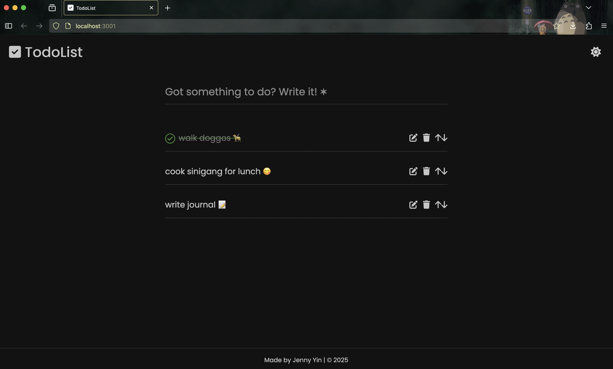
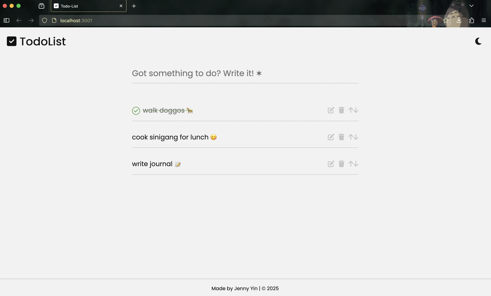

# TodoList React App

A simple and responsive TodoList application built with React. Easily add, edit, delete, move tasks up and down, and mark tasks as complete to stay organized and productive.

This one's also my first React App! ⚛

## Features

- Light and Dark mode
- Add new tasks
- Mark tasks as complete
- Edit and Delete tasks
- Move tasks up and down
- Minimalist UI
- Responsive design

## Tech Stack

- React.js
- Vanilla CSS
- JSON LocalStorage
- Deployed in Vercel

## Contribution

This project is open source and contributions are welcome! Feel free to open an issue or submit a pull request. :)
